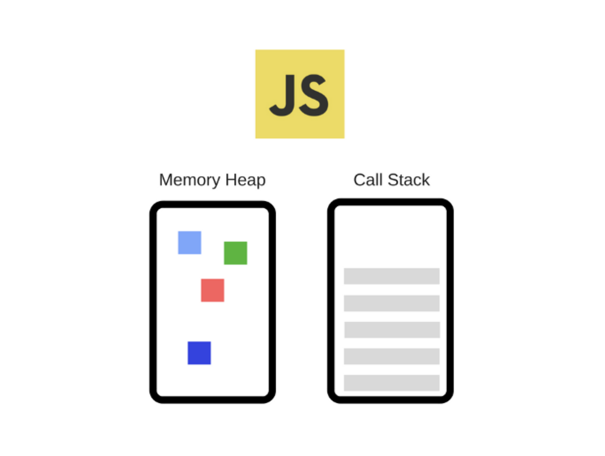

# 왜 동작 원리를 공부를 하는가?

기술 면접을 준비를 하면서 그냥 답만 찾는 것 보다는 내가 이해를 바탕으로 답변을 준비를 하는것이 나중에 꼬리 질문이 들어왔을 때도 대처가 가능 할 수 있다고 생각이 들어서 시작하였다.

클로저, 스코프, 호이스팅 등 개념을 알려면 먼저 JavaScript를 알아야 한다고 생각이 들었다. 그래서 동작 원리부터 차근차근 준비를 해보려 한다.

# 자바스크립트 동작 구조

먼저 자바스크립트를 실행하기 위해서는 **자바스크립트 엔진**이 필요하다. 자바스크립트 엔진은 여러가지가 있지만 대표적인 예로는 Google에서 만든 **V8 엔진** 이다.

